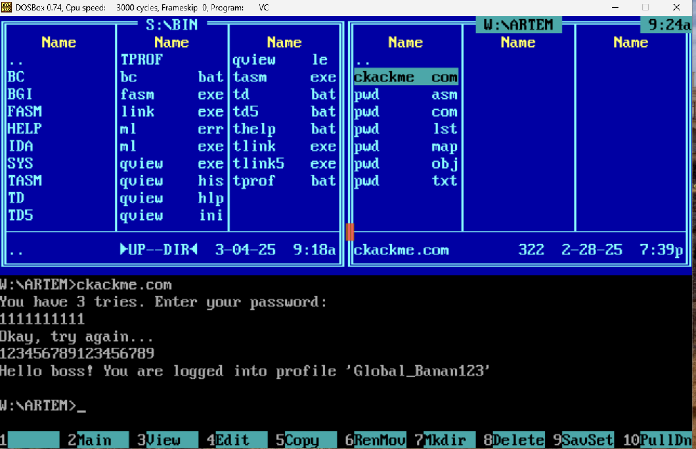
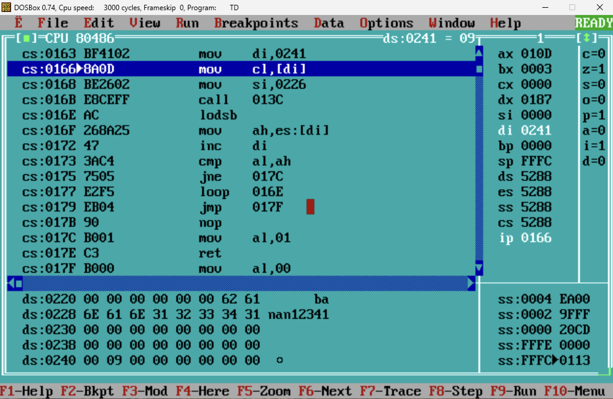
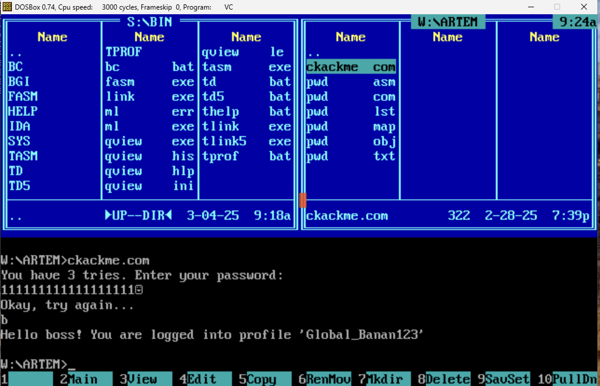
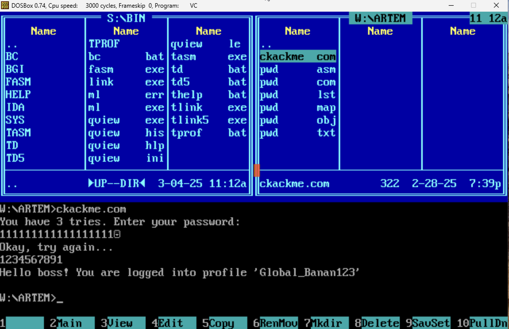
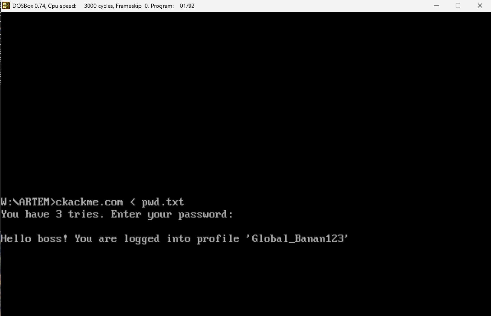
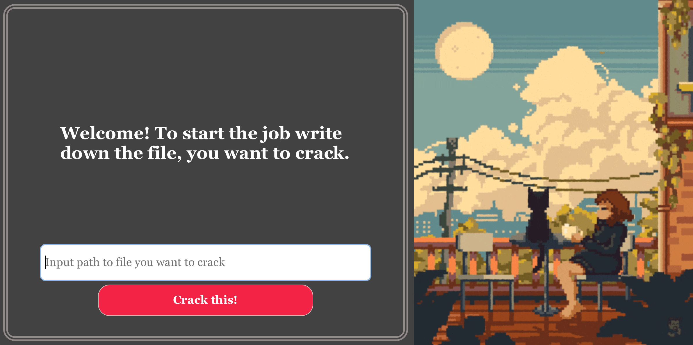

# Работа по поиску уязвимостей в x86-64 ассемблерном коде и написанию бинарного патча для исполняемого файла формата .COM

1) Весь asm x86-64 код был протестирован на эмуляторe DosBox. Для компиляции, линковки и дебага программ использованы TASM, TLINK, TDEBUGGER. Анализ исполняемого файла проходил в TDEBUGGER.
2) Графический интерфейс для бинарного патча написан на С с помощью библиотек GTK4, GStream1.0, GDK
3) Весь С код был скомпилирован с помощью Makefile на компиляторе Apple clang version 16.0.0. Операционная система - macOS 15.2 на чипе Appple M3 Pro.

# Взлом .COM:
Имеем файл ckackme.com. При запуске он запрашивает у пользователя пароль:

<p align="center"></p>

На ввод дается 3 попытки. При попытке ввода случайного пароля (пусть будет "123") получаем ошибку доступа к системе:

<p align="center"></p>

Делаем вывод, что в данном случае пароль не подходит и программа не пропускает нарушителя в систему.\
Так же проверяем, что программа работает для настоящего пароля (далее данные о нем мы не будем использовать)

<p align="center"></p>

Эмпирическим методом (вводя много одинаковых символов получаем первый взлом, который пока произошел случайно):

<p align="center"></p>

Видим, что при вводе "1111111111111111111111111111111111111111111111111111" (52 символа '1') во второй попытке, мы получаем
доступ к системе. Но при вводе того же значения в первую попытку мы получаем ошибку:

<p align="center"></p>

Значит существуют различия между вводом пароля в 1-ой и во 2-ой попытке.

> [!CAUTION]
> Ладно, хватит с нас этого жалкого детского уровня! Перейдем к анализу кода в TDEBUGGER

Немного пройдясь по коду видим такую картину:

<p align="center"></p>

Подозрительно? Ещё как! Расмотрим по частям:

```asm
cs:013C         cmp bx, 0003
cs:013F         je 014B
cs:0141         cmp bx, 0002
cs:0144         je 014F
cs:0146         cmp bx, 0001
cs:0149         je 0153
```

Можно сделать предположение, что в bx хранится номер попытки ввода. Куда ведут эти je?

```asm
cs:014B         mov di, 022F
cs:014E         ret
cs:014F         mov di, 021D
cs:0152         ret
cs:0153         mov di, 0238
cs:0156         ret
```

Еще одно предположение - в di записывается адрес буфера пароля, который вводит пользователь. Подтвердим это:

<p align="center"></p>

Видим, что по данным адресам расположены строки, состоящие из 00 символов, каждая длины 9. Так же видно, что между этими строками расположена строка "banan1234" и адрес 021D расположен до адреса этой строки. Учитывая странное поведение программы во время второй попытки ввода, делаем вывод:

> [!IMPORTANT]
> Адрес 021D - адрес буфера пароля пользователя во 2-ой попытке ввода (что так же подтверждается тем, что далее значения по этому
> адресу сравниваются с значениями по адресу 0226), а 0226 - адрес настоящего пароля, который может затираться!

Таким образом у нас есть возможность затереть пароль во 2-ой попытке! \
При вводе "123456789123456789" (либо любую другую комбинацию из символов "a1a2a3a4a5a7a8a9a1a2a3a4a5a6a7a8a9", чтобы пароль в буфере пользователя и настоящий пароль, который мы перезаписали, совпадали) получаем первую успешную умышленную попытку взлома:

<p align="center"></p>

Пролистав на 1 строчку ниже мы можем увидеть подозрительную точку по адресу 0241:

<p align="center"></p>

Этот адрес, как видно из кода, сначала передается в di, а потом значение по этому адресу (09) передается в cl

```asm
cs:0163         mov di, 0241
cs:0166         mov cl, [di]
```

Далее cl не используется до loop, в котором сверяются символы по адресам es:[di] и ds:[si]. Делаем вывод, что в cl (а именно по адресу 0241) записано количество символов, которое сверяется при проверке пароля.
/
Если (только если!) мы знаем первую букву пароля, можем написать в 1-ой попытке пароль 111111111111111111 '\1' (пароль из 18 '1' и одного символа '\1'). '\1' заменяет 09 по адресу 0241 на 01. Таким образом будет сравниваться только первая буква пароля и пользовательноского ввода далее.

<p align="center"></p>


Но вернемся к ситуации, когда пароль неизвестен (мы не хотим его знать и не будем даже пытаться), можно поступить аналогично 1-ой успешной попытке взлома: заполнить буфер из 9 символов (во 2-ой попытке ввода) и затереть 1-ый символ пароля на пользовательский.


<p align="center"></p>

Победа! 2-ая успешная попытка взлома (немного пораскинули мозгами и вместо 19 символов, используем 29). Предлагаю возвести это в абсолют (~ 65000 символов). Дойдем до стека, в котором хранится адрес возврата для функции, которая считывает пользовательский кодаю Запишем адрес вывода сообщения, сигналящего об успешном вводе пароля.

<p align="center"></p>

Dos завис... Зато вывелось сообщение, что пароль введен верно! Можно считать за нашу 3-ью успешную попытку взлома.

# Бинарный патч и графический интерфейс

Зачем заниматься этой муторной ручной работой? Смотреть код в TDEBUGGER, искать уязвимости... Можно же просто изменить пару байтов в исполняемом файле и любой пароль будем заходить (даже 0 символов). Дополнительно к этому напишем графический интерфейс, чтобы посетители кофейни не воспринимали вас за чудика...

<p align="center"></p>

<p align="center"></p>

Не забудьте скопировать репозиторий и скомпилировать программу:

```shell
git clone https://github.com/whiterno/ded_sem2.git
cd gtk
make comp
```

И наслаждайтесь чувством превосходства:

```shell
./run
```
