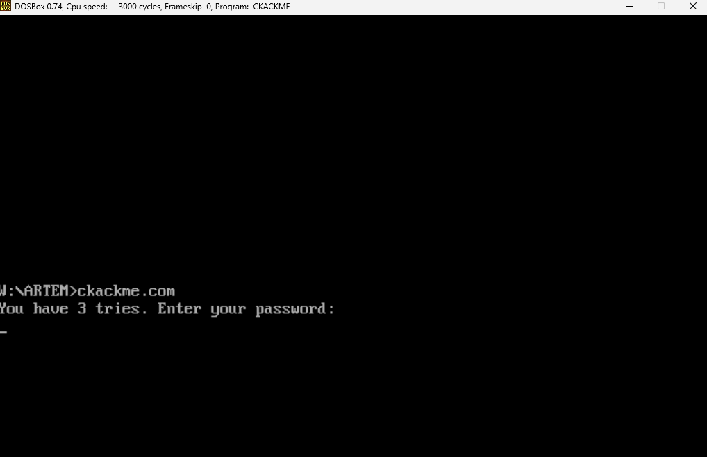
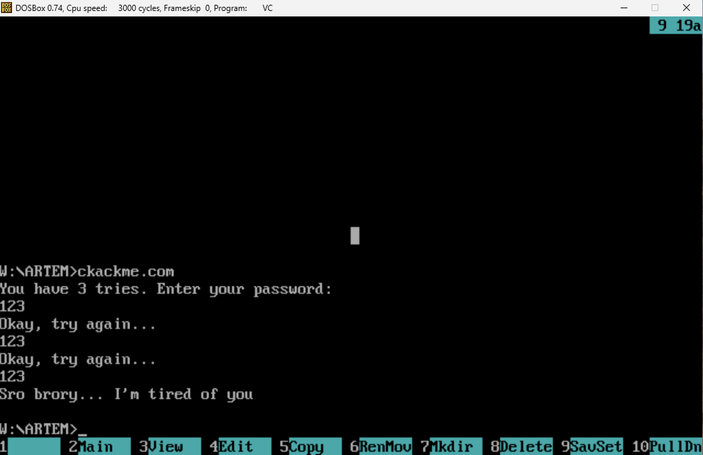
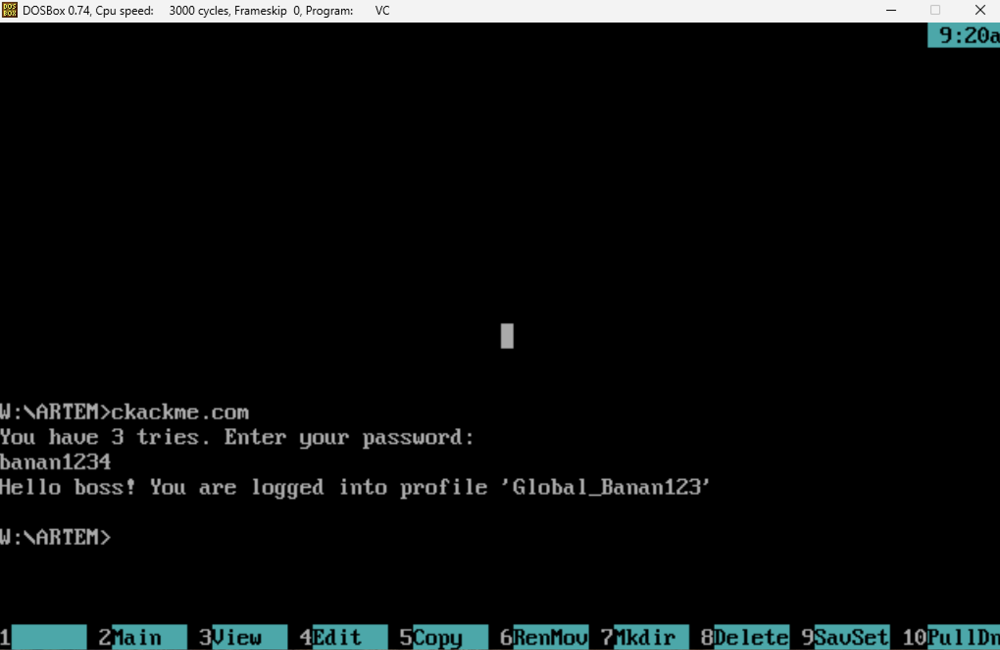
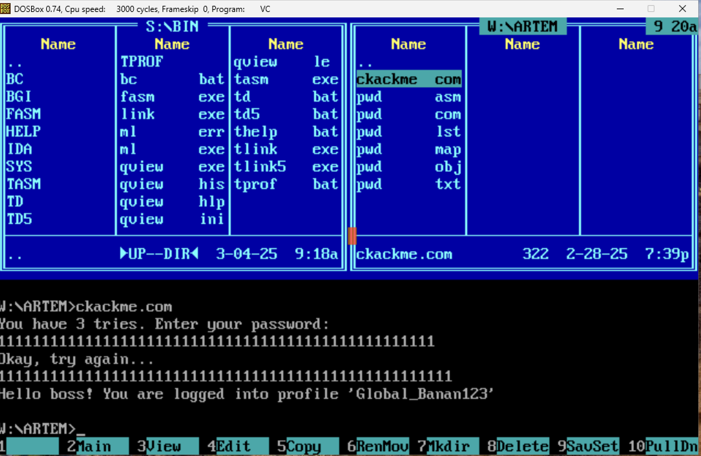
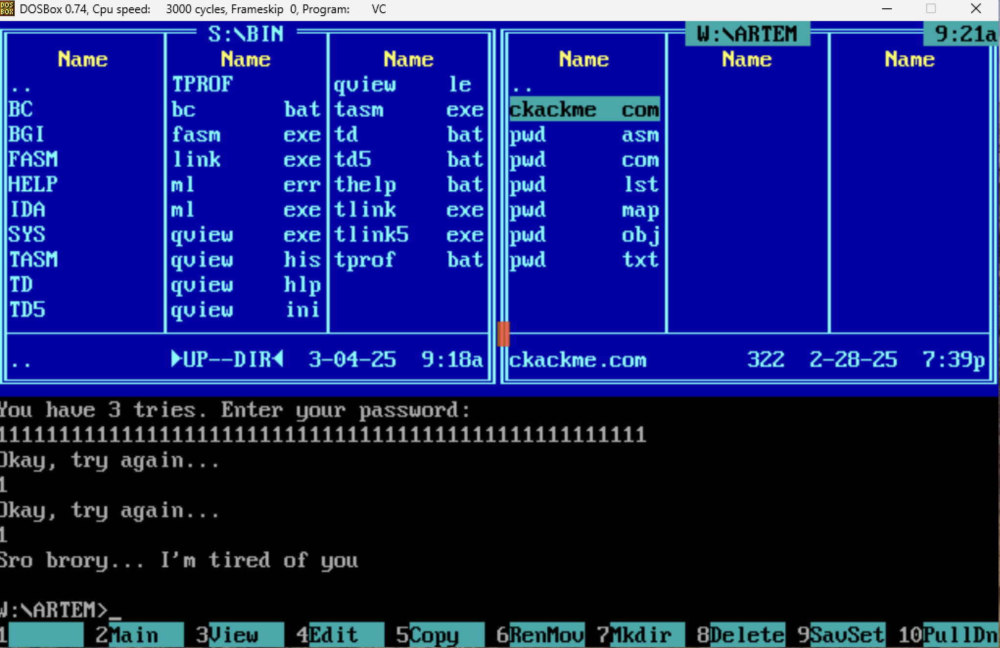
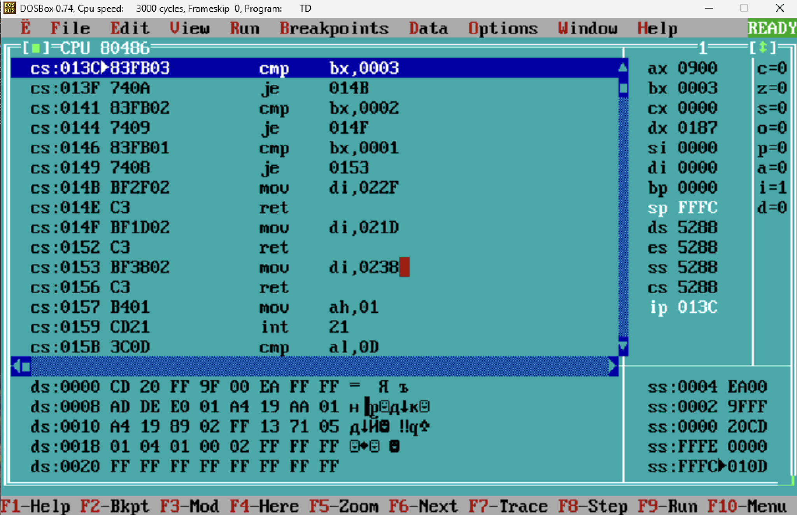
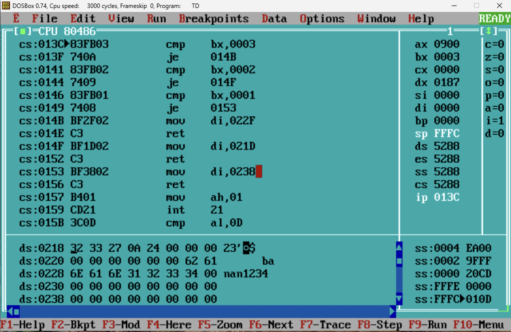

# Работа по поиску уязвимостей в x86-64 ассемблерном коде и написанию бинарного патча для исполняемого файла формата .COM

1) Весь asm x86-64 код был протестирован на эмулятор DosBox. Для компиляции и дебага программ использованы TASM, TLINK, TDEBUGGER. Анализ исполняемого файла проходил в TDEBUGGER.
2) Весь С код был скомпилирован с помощью Makefile на компиляторе Apple clang version 16.0.0. Операционная система - macOS 15.2 на чипе Appple M3 Pro.

# Взлом .COM:
Имеем файл ckackme.com. При запуске он запрашивает у пользователя пароль:
\
\

\
\
На ввод дается 3 попытки. При попытке ввода случайного пароля (пусть будет "123") получаем ошибку доступа к системе:
\
\

\
\
Делаем вывод, что в данном случае пароль не подходит и программа не пропускает нарушителя в систему.\
Так же проверяем, что программа работает для настоящего пароля (далее данные о нем мы не будем использовать)
\
\

\
\
Эмпирическим методом (вводя много одинаковых символов получаем первый взлом, который пока произошел случайно):
\
\

\
\
Видим, что при вводе "1111111111111111111111111111111111111111111111111111" (52 символа '1') во второй попытке, мы получаем
доступ к системе. Но при вводе того же значения в первую попытку мы получаем ошибку:
\
\

\
\
Значит существуют различия между вводом пароля в 1-ой и во 2-ой попытке.

> [!CAUTION]
> Ладно, хватит с нас этого жалкого детского уровня! Перейдем к анализу кода в TDEBUGGER

Немного пройдясь по коду видим такую картину:


/
/
Подозрительно? Ещё как! Расмотрим по частям:

```asm
cs:013C        cmp bx, 0003
cs:013F        je 014B
cs:0141        cmp bx, 0002
cs:0144        je 014F
cs:0146        cmp bx, 0001
cs:0149        je 0153
```

Можно сделать предположение, что в bx хранится номер попытки ввода. Куда ведут эти je?

```asm
cs:014B        mov di, 022F
cs:014E        ret
cs:014F        mov di, 021D
cs:0152        ret
cs:0153        mov di, 0238
cs:0156        ret
```

Еще одно предположение - в di записывается адрес буфера пароля, который вводит пользователь. Подтвердим это:
\
\

\
\
Видим, что по данным адресам расположены строки, состоящие из 00 символов, каждая длины 9. Так же видно, что между этими строками расположена строка "banan1234" и адрес 021D расположен до адреса этой строки. Учитывая странное поведение программы во время второй попытки ввода, делаем вывод:

> [!IMPORTANT]
> Адрес 021D - адрес буфера пароля пользователя во 2-ой попытке ввода (что так же подтверждается тем, что далее значения по этому
> адресу сравниваются с значениями по адресу 0226), а 0226 - адрес настоящего пароля, который может затираться.µ
